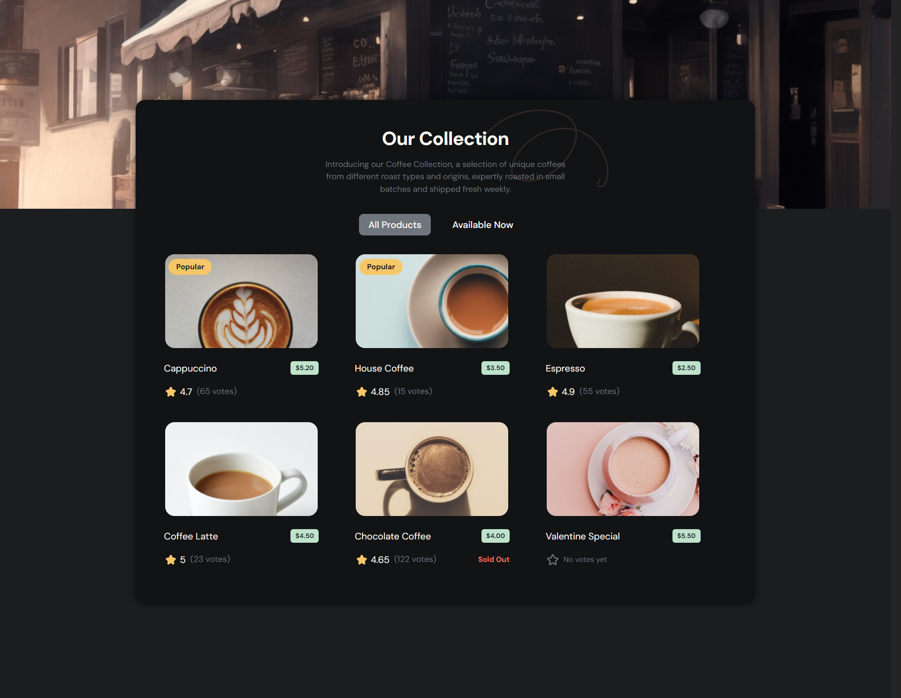

# DevChallenges Simple Coffee Listing

## Description

This is a simple coffee listing page that displays a list of coffee products. It's part of the [dev-challenges](https://devchallenges.io/path/frontend-developer) frontend developer path. The page is responsive and displays the products in a grid layout. The page is built using Svelte as the frontend framework.

## Features

- Displays a list of coffee products
- Responsive design
- Grid layout
- Users can switch between two filters: All and Available Now

## Technologies

- Svelte
- HTML
- SASS
- TypeScript
- Vite

## Installation

1. Clone the repository
2. Run `pnpm install` to install the dependencies
3. Run `pnpm dev` to start the development server
4. Open `http://localhost:5173` in your browser

## Live Demo

[Simple Coffee Listing](https://devchallenges-simple-coffee-listing.netlify.app/)

## Screenshot

## License

This project is licensed under the MIT License - see the [LICENSE](./LICENSE) file for details.

## Author

- [Robert Ramirez](https://robert-ramirez.co/)
- [LinkedIn](www.linkedin.com/in/roberto-ramirez-aguilar)